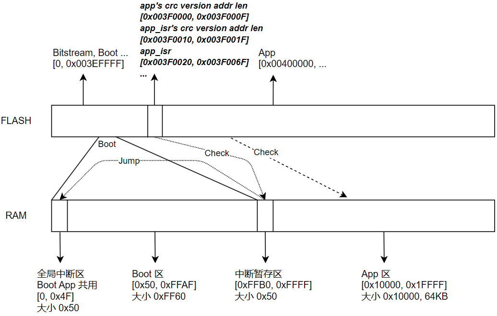

# FPGA ARTIX-7 BOOT APP

测试环境: 

- Vivado 2023.2
- Vitis 2023.2
- xc7a35tfgg484-2, 使用片内RAM, 外部FLASH对应 mt25ql128-spi-x1_x2_x4, 厂商 Micron(Numonyx)

文件说明:

- `ba_vivado.tcl`
  - 重建 Vivado 工程: `vivado -mode batch -source .\ba_vivado.tcl -nolog -nojournal`
  - 打开 Vivado 工程: `vivado .\ba_vivado\ba_vivado.xpr`
- `design_1_wrapper.xsa`, Vivado 导出的硬件(含位流文件), Vitis 可以从这里创建 Platform
- `boot` 该文件夹是Vitis Embedded工程对应的 boot 源码, flash 驱动 `bsp_spi_flash.c` 不同的Flash型号不一样, 注意修改
- `app` 该文件夹是Vitis Embedded工程对应的 app 源码
- `uptool.py`, 升级工具Python3

地址划分:

